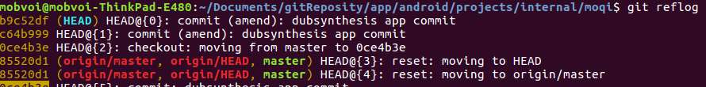

# **1.git常用命令学习**
+ df-h 查询硬盘容量  
--------
 **远程服务器**
+ ssh ci_tester@10.1.205.38 链接远程服务器
+ scp ci_tester@10.1.205.38:~/*.tar.gz 远程copy后缀为tar.gz的文件
+ scp -r *.tar.gz ci_tester@10.1.205.38:~将本目录下.tar.gz文件copy到远程服务器的home目录下
+ exit 退出远程服务器  
--------
**git log 和git reflog**  
+ git log 命令可以显示所有提交过的版本信息  
  
+ git reflog可以查看所有分支的所有操作记录（包括已经被删除的 commit 记录和 reset 的操作）例如执行 git reset --hard HEAD~1，退回到上一个版本，用git log则是看不出来被删除的commitid，用git reflog则可以看到被删除的commitid，我们就可以买后悔药，恢复到被删除的那个版本。如下图所示：  
  有一次不小心删除了一次commit，通过本命令也能恢复。  

      
------------  
+ git commit --amend 更改上一次提交，不会增加一次commit记录。
--------  
+ history | grep ssh 查找最新使用的ssh命令记录。
--------------
**查看某个目录下，某个文件中，包含某个字符串的字段**  
+ find [path] [option] [action] 查看/tmp目录下，ica.txt文件中包含"abc"字符串的字段: find /tmp -name ica.txt |xargs grep "*abc*"
--------------
**git分离头指针**  
+ 产生原因：在切换分支时，使用git checkout命令直接将分支切换到某一个commit上。
+ 切换后则处于分离头指针状态，本质上说，现在工作处在没有分支的状态，在这种状态下，如果直接切回现有分支，则很可能在当前commit做的若干改动会被git当作垃圾清除掉
另一方面，如果是出于想对某一个commit进行尝试性修改的目的，则使用分离头指针会很方便
+ 若要保留该次修改，则直接 git checkout -b newbranch创建新分支，则当前的提交则会加入该分支。然后merge给master即可。  
+ 若多人维护git工作目录，则修改后可能当前版本比较落后，可以采用以下步骤：  
>1. 在当前的master分支上的修改暂存起来  
>>>git stash  

>2. 暂存修改后，在本地新建分支（new_branch为新分支的名字）  
>>>git checkout -b new_branch  

>3. 将暂存的修改放到新建分支中  

>>>git stash pop  

>4. 使用TortoiseGit进行commit，比如add、modify、delete.  

>5. 将提交的内容push到远程服务器  
>>>git push
----
+ git reset HEAD XXX/XXX/XXX.c 对某个文件进行撤销  
+ git reset HEAD 如果后面什么都不跟的话 就是上一次add 里面的全部撤销了
+ git clean -f 删除当前目录下所有没有track过的文件. 他不会删除.gitignore文件里面指定的文件夹和文件, 不管这些文件有没有被track过.

+ git reset --hard和git clean -f结合使用他们能让你的工作目录完全回退到最近一次commit的时候  
+ 使用git clean -xdf会将所有的没有track的文件全部清除。

+ git show可以展示最新提交 git show --name-only
+ git reset --soft changeId 回退某次commit
+ git reset HEAD .idea 删除本地的版本
+ git diff --cached
+ git push orginal branch

>1.Git：如何在旧提交之间添加提交
原来的：AB—BC—CD—EF   MASTER
希望的：AB—BC—SA—CD—EF   MASTER
---------------------------------------------
$ git checkout master
$ git checkout -b temp BC 
$ git add
$ git commit # your changes that will be SA
--------------------------------------------
操作之后：
AB—BC—SA  temp
      \
      CD—EF MASTER
使用
$ git rebase temp master
实现

>使用 rebase 修改 Git 的提交顺序和并提交
使用git rebase -i HEAD~4
列表是倒序的，合并是将最近的合并到旧的提交。
  

